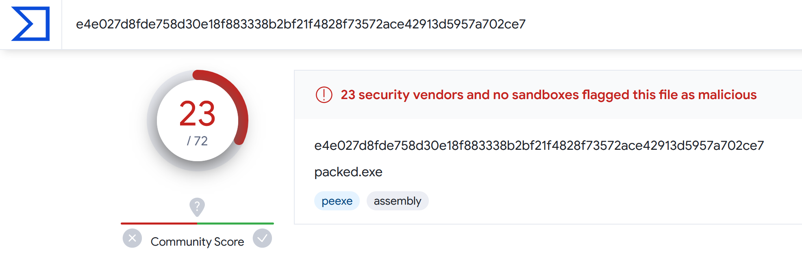

# 🛡 PowerShell Payload Encryptor and Packer 📦

This PowerShell script facilitates the encryption of a binary payload file (e.g., an executable) and generates a new executable designed to decrypt and execute the encrypted payload on the target system. This tool aims to assist in secure payload delivery by leveraging encryption to avoid detection by security software.

However, the generated executable is currently detected by 23 out of 72 AVs on VirusTotal, including by Microsoft Defender. Though, that's 38 less than the malware with no crypter.

## 🌟 Features

- **🔒 Payload Encryption**: Encrypts any binary file (e.g., an executable payload) using AES encryption.
- **📄 Automatic Executable Generation**: Generates an executable capable of decrypting and executing the encrypted payload.
- **👻 Stealth Enhancements**: Includes steps to hide the execution directory and exclude it from Windows Defender scans, reducing the chance of detection.

## 📋 Prerequisites

Before running this script, ensure you have the following:

- Windows 10 or higher (due to specific features like `Add-MpPreference`)
- PowerShell 5.1 or higher
- PS2EXE: simply run `Install-Module -Name ps2exe` in Windows Terminal or Powershell ([more information](https://www.powershellgallery.com/packages/ps2exe/1.0.13))

## 🚀 Usage

1. **📁 Prepare Your Payload**: Ensure the binary file you intend to encrypt is accessible on your system.

2. **▶️ Run the Encryption Script**: Execute the provided PowerShell script. When prompted, enter the full file path to the payload you wish to encrypt.

3. **📬 Distribute and Execute**: The script outputs an encrypted version of your payload and a new executable (`packed.exe`).

4. **🎯 Execution on Target System**: Run the generated executable on the target system. It will decrypt and execute the payload automatically.

## 💖 Acknowledgments

- This script utilizes built-in PowerShell and .NET Framework capabilities for encryption and file handling.

## ⚠️ Disclaimer

This project is for educational purposes only. The author is not responsible for any misuse or damage caused by this script. Always ensure you have permission to run such scripts and tools in your environment.

